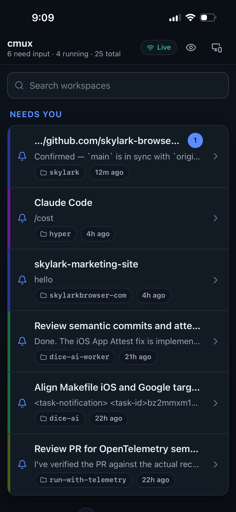
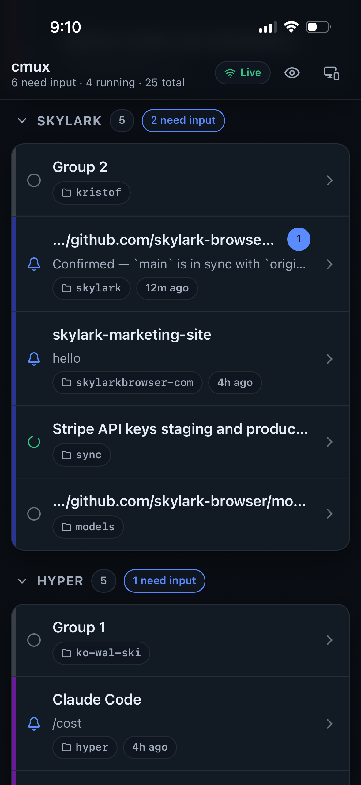
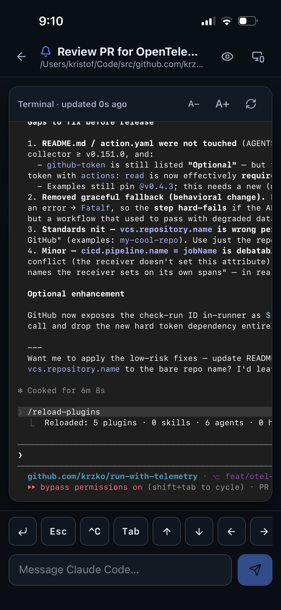
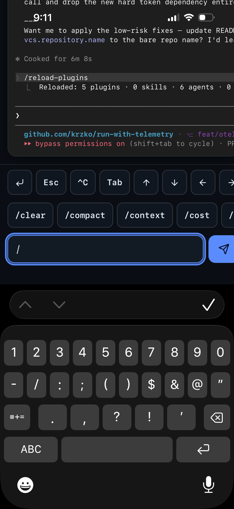

# cmux-web

A responsive, mobile-first web interface for [cmux](https://cmux.com). It mirrors the cmux sidebar and terminals as a web app you can drive from your phone, so you can triage and unblock your agent workspaces from anywhere on your tailnet.

<div align="center">
  <table>
    <tr>
      <td align="center" width="25%">
        
        <br /><sub>Workspace list</sub>
      </td>
      <td align="center" width="25%">
        
        <br /><sub>Live terminal</sub>
      </td>
      <td align="center" width="25%">
        
        <br /><sub>Workspace details</sub>
      </td>
      <td align="center" width="25%">
        
        <br /><sub>Agent slash commands</sub>
      </td>
    </tr>
  </table>
</div>

## Why it exists

Running many coding agents as cmux workspaces on one Mac, the bottleneck is human input: agents pause on questions, permission prompts, and plan approvals. Away from the desk there is no good way to see which agent is blocked and act on it. cmux exposes a complete control API over a local Unix socket, so a thin, authenticated web client is enough. cmux-web is that client. It stays cmux native: it only uses what the cmux socket provides and adds no external tooling.

## Features

- Triage list of workspace groups and workspaces, with the ones that need input floated to the top and unread counts shown.
- Live status per workspace (idle, running, needs input), shown by colour, icon, and label, updated in real time without manual refresh.
- Search across all workspaces, collapsible groups, and a connected grouped list.
- Live terminal view in the workspace's true colours, matching the native cmux terminal. It opens at the latest line, auto-follows the tail, offers a jump-to-bottom control, and has an A-/A+ font size control.
- Pane and tab switcher for workspaces with splits and multiple surfaces; tapping a tab shows that surface's terminal.
- A single input. On an agent surface it submits to the agent; in a shell it types the command and runs it. A key toolbar sends Enter, Esc, Ctrl-C, Tab, and arrows.
- Slash-command autocomplete for the detected agent (Claude Code, Codex, OpenCode, Gemini, Grok, Amp, Cursor, Copilot, Pi, Kiro), shown as you type "/".
- Inline replies to pending questions, permission prompts (with a two-tap confirm to approve), and plans.
- Hide-content mode blurs terminal text and previews that may hold secrets, and reveals them on tap.
- Light and dark themes (auto plus toggle), safe-area aware. Add it to your phone's home screen and it launches full screen as a standalone app, with no browser chrome.
- Password auth gate for exposure over Tailscale.

## How it works

cmux-web is a [TanStack Start](https://tanstack.com/start) app (React, Router, Query) rendered on the server and hydrated on the client. It follows clean architecture with dependency inversion, so each layer depends only on the one below through interfaces.

```
src/
  domain/          entities, ports, pure services (status, triage, layout, agents)
  application/     use cases that orchestrate ports
  infrastructure/  adapters: cmux CLI gateway, events source, auth
  server/          composition root (DI) + server functions + auth guards
  routes/          routes (/, /w/$ref, /login, /api/events)
  components/ hooks/ lib/   presentation
```

- The single seam to cmux is `CmuxTransport`. It shells out to the local `cmux` CLI, which owns socket framing and password auth. Swapping in a direct Unix-socket client later means implementing that one interface. The browser never touches the socket; it only sees the authenticated HTTP app.
- Terminal input and output use the ref-safe CLI wrappers (`read-screen`, `send`, `send-key`). Raw rpc targeting a `surface_ref` silently falls back to the focused surface, so it is never used for input.
- Live updates come from one server-side `cmux events` subscription that fans out to browser clients over Server-Sent Events. Each event invalidates the affected query slice; bulk terminal text is pulled, never streamed.
- The coloured terminal is cmux's own render grid (`terminal.replay`), rendered cell by cell with the workspace's theme.

Background notes live in [`docs/`](docs/).

## Setup

Requires Node 20+, pnpm, and cmux with full socket access enabled. Verify with:

```bash
cmux rpc workspace.group.list '{}'   # should return your groups
```

Then:

```bash
pnpm install
cp .env.example .env   # set CMUX_SOCKET_PATH, APP_PASSWORD (see .env.example)
pnpm dev               # http://localhost:3000
```

Leave `APP_PASSWORD` empty for local dev to disable the auth gate. Set it before exposing the app beyond your machine.

## Serving over Tailscale

Set `APP_PASSWORD` (and any `CMUX_*` overrides) in `.env`, then:

```bash
pnpm build            # after any code change
pnpm serve:tailnet    # server on 127.0.0.1:31337 + `tailscale serve`, prints the URL
pnpm serve:tailnet:stop
```

`serve:tailnet` reads `.env`, starts the built server bound to loopback (override the port with `PORT`), fronts it with `tailscale serve` over HTTPS, and prints the tailnet URL. `serve:tailnet:stop` stops the server and runs `tailscale serve reset`. The cmux socket stays local to the Mac; only the authenticated HTTPS app is reachable, and only on the tailnet. Open the printed `https://<host>.ts.net` URL on your phone, then use Add to Home Screen. It installs as a PWA and launches full screen, with no browser chrome.

## Security

- The cmux socket never leaves the Mac. Only the HTTP app is exposed, gated by a shared password, and reached over the tailnet.
- Terminal text can contain secrets, so hide-content mode redacts it on demand and the server never logs terminal output.
- Input actions are not silently retried, and approving a permission takes a confirm tap to avoid accidental destructive approvals.

## Commands

- `pnpm dev` local dev server
- `pnpm build` production build
- `pnpm start` run the production server (loopback, `PORT` / `HOST` env)
- `pnpm serve:tailnet` / `pnpm serve:tailnet:stop` expose on the tailnet (31337)
- `pnpm typecheck` generate routes and type-check
- `pnpm test` run the test suite

## Development

State is normalised in TanStack Query and reconciled with the event stream. Domain and application logic is pure and covered by tests using fake gateways, no mocking framework required. Run `pnpm test` for the suite and `pnpm typecheck` before committing.
